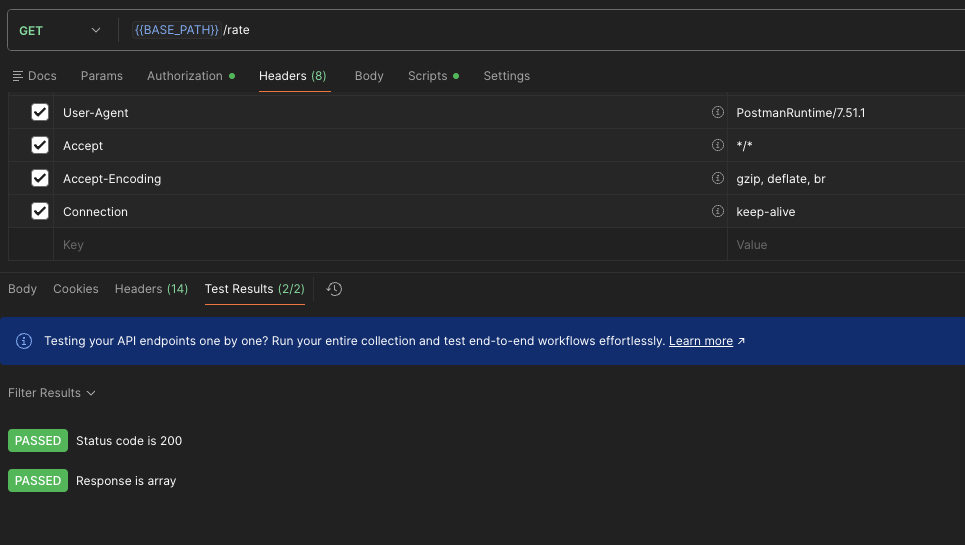
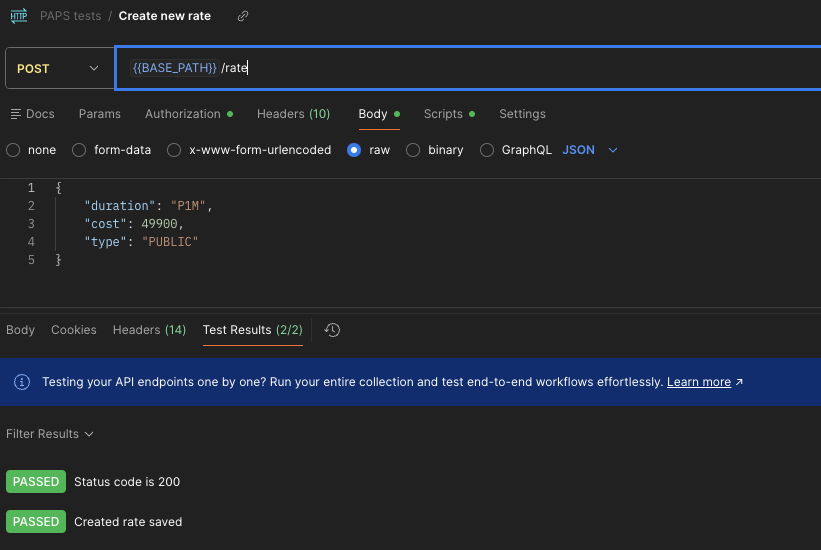
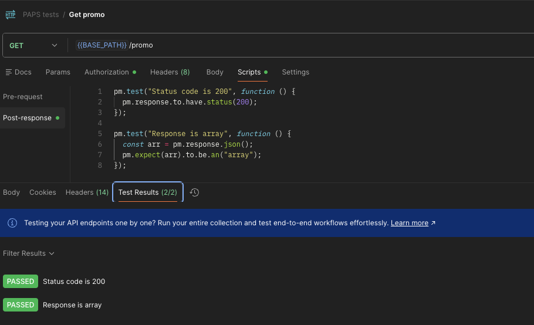
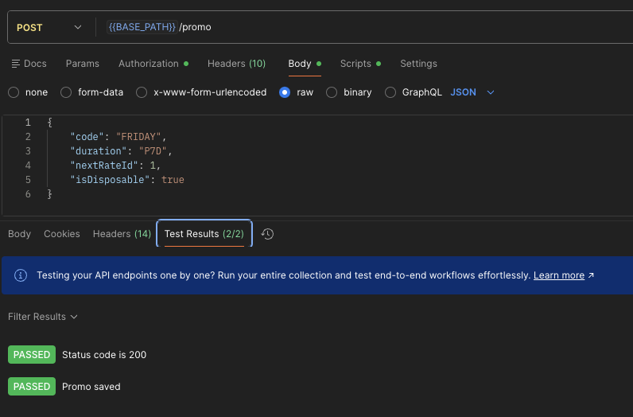
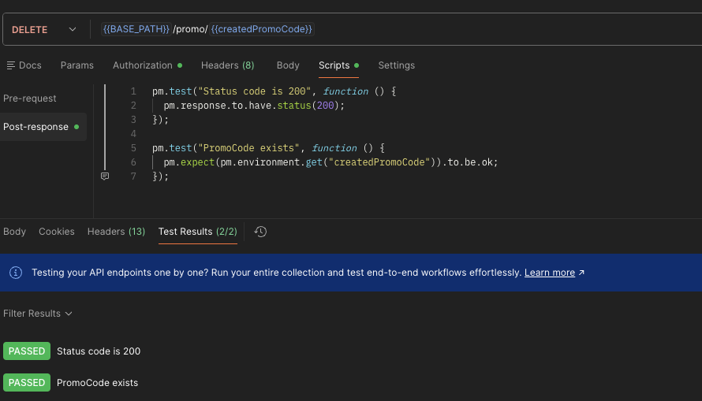
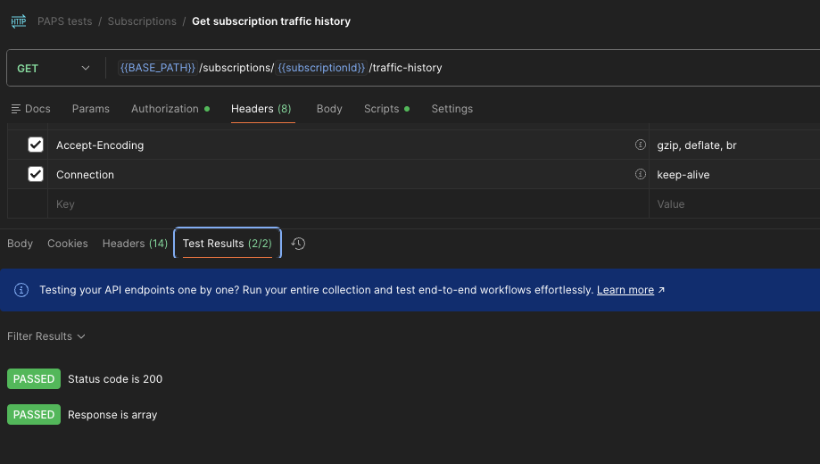
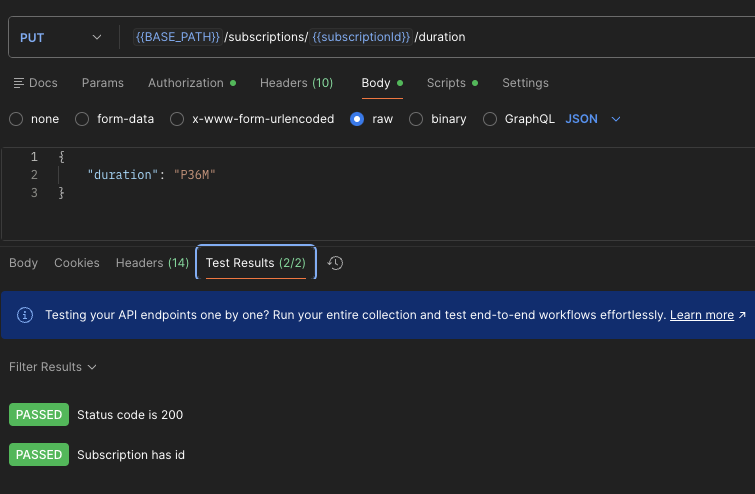

# Лабораторная работа №4 - Проектирование REST API

**Тема:** Проектирование REST API\
**Цель:** Получить опыт проектирования программного интерфейса.


------------------------------------------------------------------------

## Принятые проектные решения

1.  Использован REST-подход: ресурсы оформлены как /rate, /promo,
    /subscriptions.
2.  Идентификаторы передаются в path (UUID для подписок, int64 для
    тарифов, string для промокодов).
3.  Используется JSON как формат обмена данными.
4.  DTO строго описаны (RateDto, PromoDto, SubscriptionDto и др.) в Open API документе.
5.  HTTP-методы применяются по семантике (GET, POST, PUT, DELETE).
6.  Удаление ресурсов происходит через DELETE по идентификатору.
7.  Поддерживается JWT Bearer и Basic Auth авторизация.
8.  Единый стиль именования URL.

------------------------------------------------------------------------

## Общие настройки Postman

Environment variables:

-   baseUrl = http://localhost:8080
-   username
-   password
-   subscriptionId

------------------------------------------------------------------------

## 1) GET /rate

URL: {{baseUrl}}/rate

Response:

```json
[
    {
        "id": 1,
        "duration": "P1M",
        "cost": 49900,
        "type": "PUBLIC"
    },
    ...
]
```

Postman Tests:

``` javascript
pm.test("Status code is 200", function () {
  pm.response.to.have.status(200);
});

pm.test("Response is array", function () {
  const arr = pm.response.json();
  pm.expect(arr).to.be.an("array");
});
```



------------------------------------------------------------------------

## 2) POST /rate

URL: {{baseUrl}}/rate

Body:

``` json
{ "duration": "P1M", "cost": 49900, "type": "PUBLIC" }
```

Postman Tests:

``` javascript
pm.test("Status code is 200", function () {
  pm.response.to.have.status(200);
});

pm.test("Created rate saved", function () {
  const json = pm.response.json();
  pm.expect(json).to.have.property("id");
  pm.environment.set("createdRateId", String(json.id));
});
```



------------------------------------------------------------------------

## 3) DELETE /rate/{id}

URL: {{baseUrl}}/rate/{{createdRateId}}

Postman Tests:

``` javascript
pm.test("Status code is 200", function () {
  pm.response.to.have.status(200);
});

pm.test("RateId exists", function () {
  pm.expect(pm.environment.get("createdRateId")).to.be.ok;
});
```


------------------------------------------------------------------------

## 4) GET /promo

URL: {{baseUrl}}/promo

Response:
```json
[
    {
        "code": "1DFHDAGDHJJHJGF",
        "duration": "P3D",
        "nextRate": {
            "id": 454,
            "duration": "P1M",
            "cost": 23900,
            "type": "BASE"
        },
        "isDisposable": true,
        "isGift": false,
        "isActive": false
    },
    ...
]
```

Postman Tests:

``` javascript
pm.test("Status code is 200", function () {
  pm.response.to.have.status(200);
});

pm.test("Response is array", function () {
  const arr = pm.response.json();
  pm.expect(arr).to.be.an("array");
});
```



------------------------------------------------------------------------

## 5) POST /promo

URL: {{baseUrl}}/promo

Response:

``` json
{ "code": "FRIDAY" }
```

Body:

``` json
{ "code": "FRIDAY", "duration": "P7D", "nextRateId": 1, "isDisposable": true }
```

Postman Tests:

``` javascript
pm.test("Status code is 200", function () {
  pm.response.to.have.status(200);
});

pm.test("Promo saved", function () {
  const json = pm.response.json();
  pm.expect(json).to.have.property("code");
  pm.environment.set("createdPromoCode", json.code);
});
```



------------------------------------------------------------------------

## 6) DELETE /promo/{code}

URL: {{baseUrl}}/promo/{{createdPromoCode}}

Postman Tests:

``` javascript
pm.test("Status code is 200", function () {
  pm.response.to.have.status(200);
});

pm.test("PromoCode exists", function () {
  pm.expect(pm.environment.get("createdPromoCode")).to.be.ok;
});
```



------------------------------------------------------------------------

## 7) GET /subscriptions/{id}/traffic-history

URL: {{baseUrl}}/subscriptions/{{subscriptionId}}/traffic-history

Response:

``` json
[
    {
        "date": "2026-02-08",
        "usage": 3720077695,
        "serverCode": "finland_adminvps_elfin_bouquet",
        "countryName": "Финляндия"
    },
    ...
]
```

Postman Tests:

``` javascript
pm.test("Status code is 200", function () {
  pm.response.to.have.status(200);
});

pm.test("Response is array", function () {
  const arr = pm.response.json();
  pm.expect(arr).to.be.an("array");
});
```



------------------------------------------------------------------------

## 8) PUT /subscriptions/{id}/duration

URL: {{baseUrl}}/subscriptions/{{subscriptionId}}/duration

Response:

``` json
{
    "id": "431cf556-bc8c-42f2-8f6f-890e0aac9a3b",
    "ordinal": 1,
    "startDate": "15.12.2024",
    "endDate": "15.12.2027",
    ...
}
```

Body:

``` json
{ "duration": "P36M" }
```

Postman Tests:

``` javascript
pm.test("Status code is 200", function () {
  pm.response.to.have.status(200);
});

pm.test("Subscription has id", function () {
  const json = pm.response.json();
  pm.expect(json).to.have.property("id");
});
```

