# Лабораторная работа №6

**Тема:** Использование шаблонов проектирования

**Цель работы:** Получить опыт применения шаблонов проектирования при написании кода программной системы.

В рамках лабораторной в проект добавлены 12 GoF-шаблонов:
- Порождающие: `Singleton`, `Factory Method`, `Builder`
- Структурные: `Proxy`, `Decorator`, `Adapter`, `Facade`
- Поведенческие: `Chain of Responsibility`, `Command`, `Observer`, `Strategy`, `Template Method`

---

## Порождающие шаблоны

### Singleton

**Общее назначение:** гарантировать наличие единственного экземпляра объекта и единой точки доступа к нему.

**Назначение в функционале:** единая thread-safe сессия авторизации для YooKassa с кэшем токена и контролем времени жизни.

**UML:**
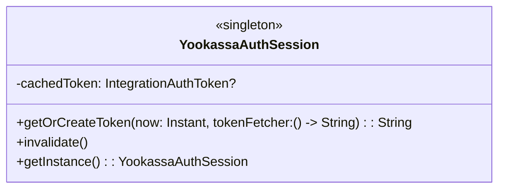

**Фрагмент кода:**
```kotlin
class YookassaAuthSession private constructor() {
    @Volatile
    private var cachedToken: IntegrationAuthToken? = null

    fun getOrCreateToken(now: Instant, tokenFetcher: () -> String): String { /* ... */ }

    companion object {
        @Volatile private var instance: YookassaAuthSession? = null
        fun getInstance(): YookassaAuthSession = instance ?: synchronized(this) { /* ... */ }
    }
}
```

---

### Factory Method

**Общее назначение:** делегировать создание объектов подклассам/конкретным фабрикам.

**Назначение в функционале:** создание разных типов подписок (trial/monthly) через единый контракт.

**UML:**
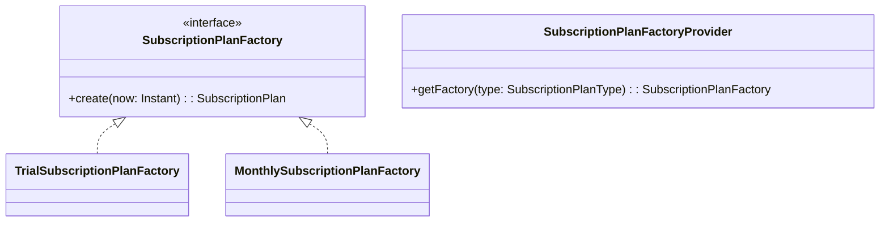

**Фрагмент кода:**
```kotlin
interface SubscriptionPlanFactory {
    fun create(now: Instant): SubscriptionPlan
}

class MonthlySubscriptionPlanFactory : SubscriptionPlanFactory {
    override fun create(now: Instant): SubscriptionPlan = SubscriptionPlan(
        title = "Monthly",
        expiresAt = now.plus(30, ChronoUnit.DAYS),
        hasAutoRenew = true
    )
}
```

---

### Builder

**Общее назначение:** пошагово собирать сложный объект с разными optional-параметрами.

**Назначение в функционале:** формирование payload для Telegram-уведомлений с метаданными.

**UML:**
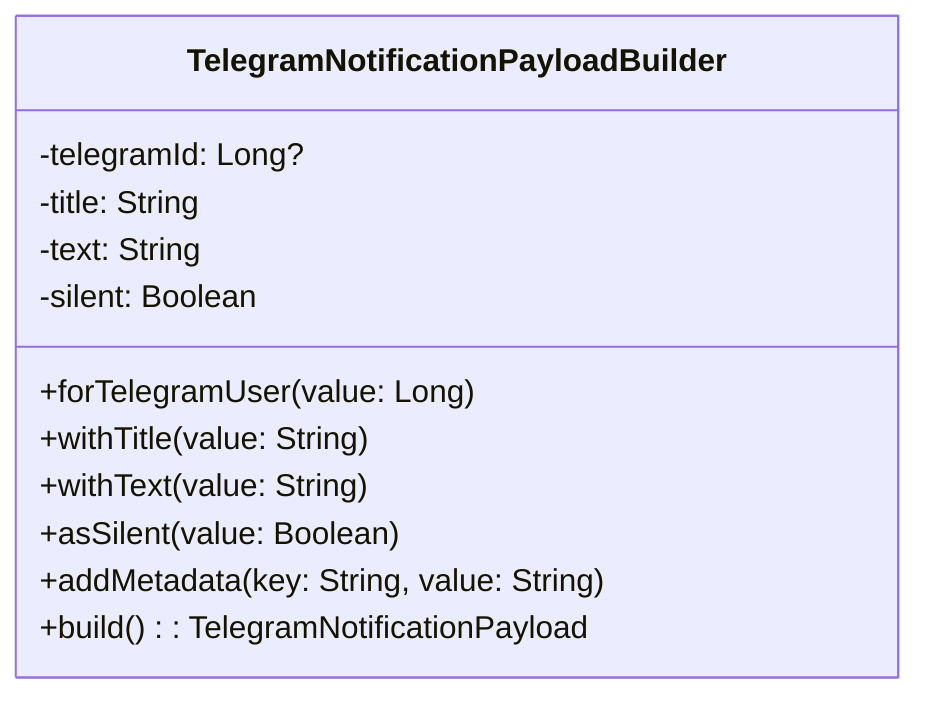

**Фрагмент кода:**
```kotlin
val payload = TelegramNotificationPayloadBuilder()
    .forTelegramUser(value = 42L)
    .withTitle(value = "Subscription")
    .withText(value = "Activated")
    .addMetadata(key = "source", value = "payment")
    .build()
```

---

## Структурные шаблоны

### Proxy

**Общее назначение:** подменять доступ к объекту-оригиналу, добавляя контроль/логирование/кеширование.

**Назначение в функционале:** замер времени отправки платежного чека через прокси вокруг отправщика.

**UML:**
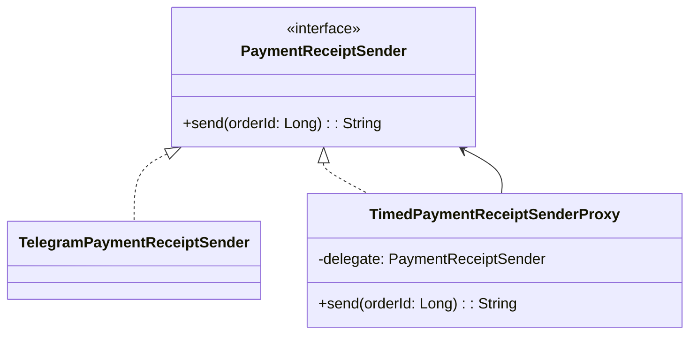

**Фрагмент кода:**
```kotlin
class TimedPaymentReceiptSenderProxy(
    private val delegate: PaymentReceiptSender
) : PaymentReceiptSender {
    override fun send(orderId: Long): String {
        var result = ""
        val elapsedMs = measureTimeMillis { result = delegate.send(orderId) }
        return "$result (execution ${elapsedMs}ms)"
    }
}
```

---

### Decorator

**Общее назначение:** динамически добавлять объекту дополнительное поведение без изменения исходного класса.

**Назначение в функционале:** добавление ролевой проверки (только админ) поверх отправки уведомлений.

**UML:**
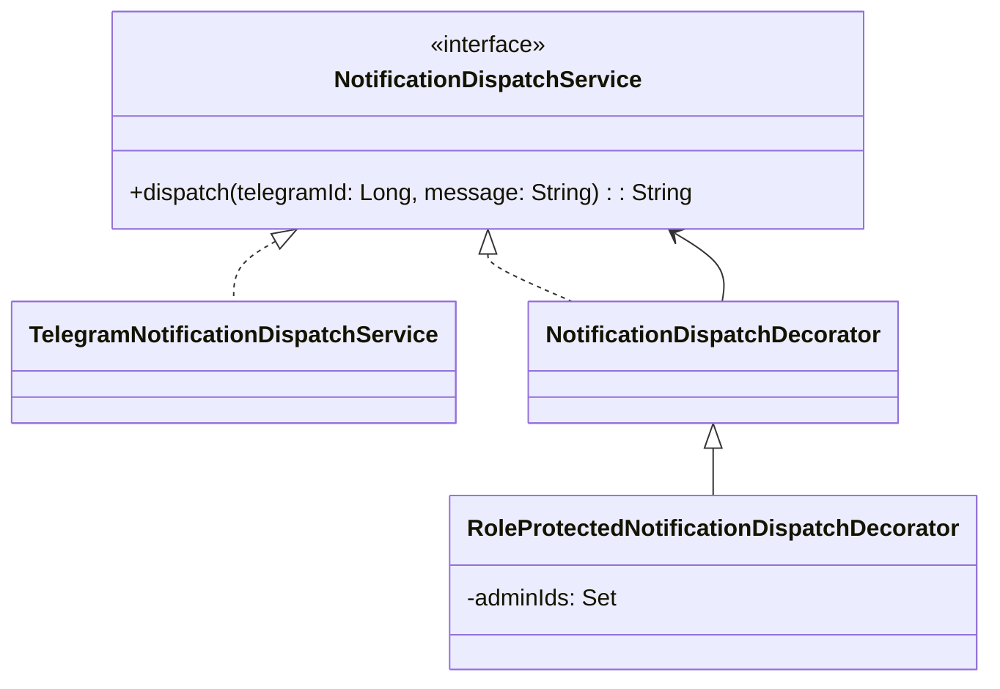

**Фрагмент кода:**
```kotlin
class RoleProtectedNotificationDispatchDecorator(
    delegate: NotificationDispatchService,
    private val adminIds: Set<Long>
) : NotificationDispatchDecorator(delegate) {
    override fun dispatch(telegramId: Long, message: String): String {
        require(adminIds.contains(telegramId)) { "Only admin can dispatch notification" }
        return super.dispatch(telegramId, message)
    }
}
```

---

### Adapter

**Общее назначение:** адаптировать несовместимый интерфейс внешнего объекта к внутреннему контракту.

**Назначение в функционале:** преобразование ответа Connect Service в формат узла подписки, используемый внутри приложения.

**UML:**
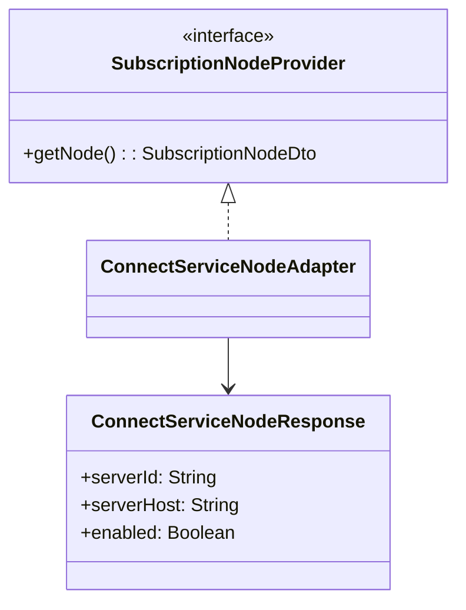

**Фрагмент кода:**
```kotlin
class ConnectServiceNodeAdapter(
    private val source: ConnectServiceNodeResponse
) : SubscriptionNodeProvider {
    override fun getNode(): SubscriptionNodeDto = SubscriptionNodeDto(
        nodeId = source.serverId,
        endpoint = source.serverHost,
        isAvailable = source.enabled
    )
}
```

---

### Facade

**Общее назначение:** предоставить единый упрощенный интерфейс к набору подсистем.

**Назначение в функционале:** единая точка оформления покупки подписки (создание заказа, списание, активация, уведомление).

**UML:**
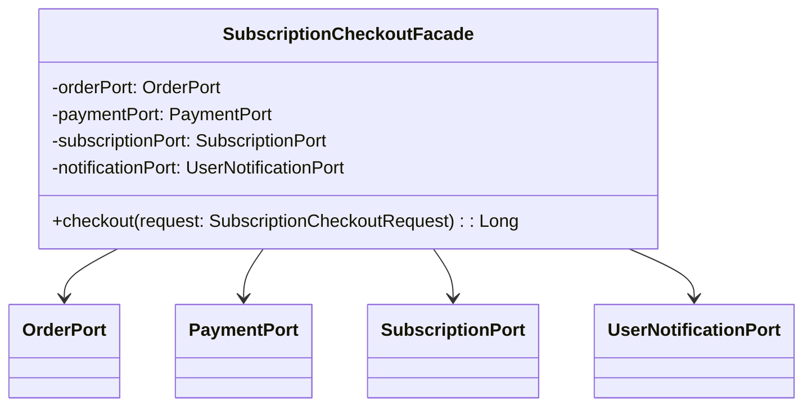

**Фрагмент кода:**
```kotlin
val orderId = orderPort.createOrder(userId = request.userId, rateId = request.rateId, amount = request.amount)
if (!paymentPort.capture(orderId = orderId)) {
    throw IllegalStateException("Payment for orderId=$orderId was not captured")
}
subscriptionPort.activate(userId = request.userId, rateId = request.rateId)
notificationPort.send(telegramId = request.userId, text = "Subscription activated")
```

---

## Поведенческие шаблоны

### Chain of Responsibility

**Общее назначение:** последовательно передавать запрос по цепочке обработчиков.

**Назначение в функционале:** валидация активации подписки через цепочку проверок (блокировка пользователя, активная подписка, pending payment).

**UML:**
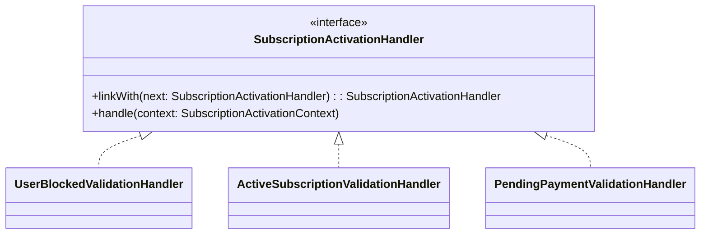

**Фрагмент кода:**
```kotlin
val first = UserBlockedValidationHandler()
val second = ActiveSubscriptionValidationHandler()
val third = PendingPaymentValidationHandler()
first.linkWith(next = second).linkWith(next = third)
first.handle(context = context)
```

---

### Command

**Общее назначение:** инкапсулировать операцию в объект-команду.

**Назначение в функционале:** операции с заказом (создать/отменить) как команды с единым исполнителем.

**UML:**
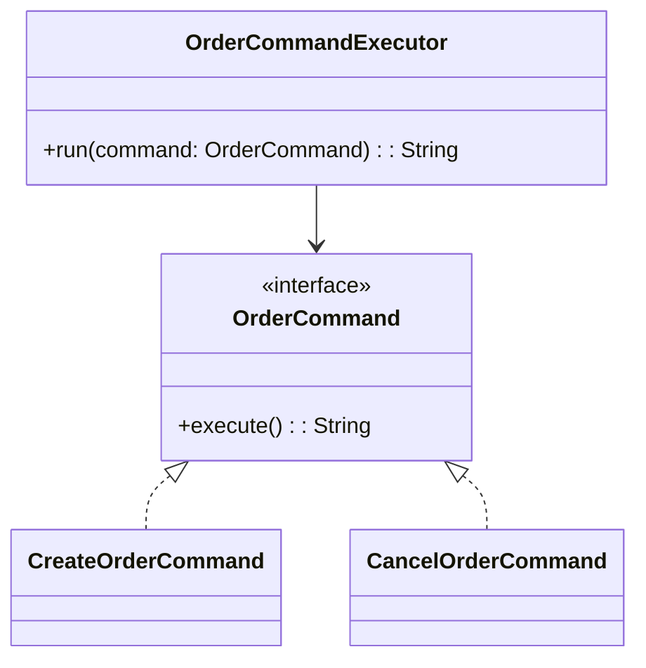

**Фрагмент кода:**
```kotlin
val created = executor.run(
    command = CreateOrderCommand(orderPort = orderPort, userId = 7L, rateId = 2L)
)
val cancelled = executor.run(
    command = CancelOrderCommand(orderPort = orderPort, orderId = 900L)
)
```

---

### Observer

**Общее назначение:** организовать подписку наблюдателей на события издателя.

**Назначение в функционале:** реакция нескольких подсистем на смену статуса подписки (например, уведомления и метрики).

**UML:**
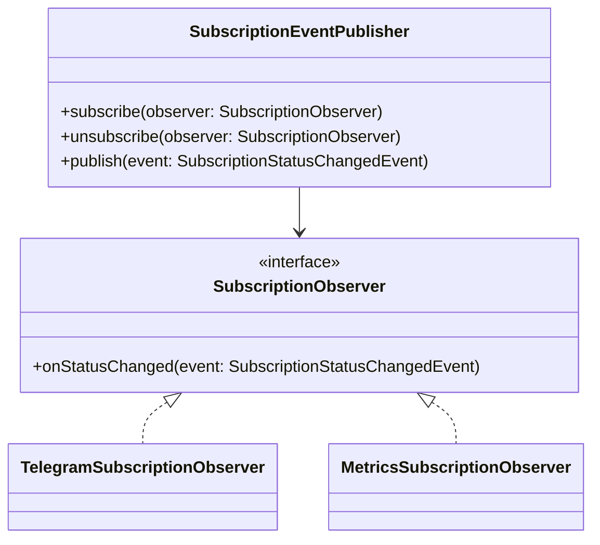

**Фрагмент кода:**
```kotlin
publisher.subscribe(observer = TelegramSubscriptionObserver())
publisher.subscribe(observer = MetricsSubscriptionObserver())
publisher.publish(
    event = SubscriptionStatusChangedEvent(userId = 12L, oldStatus = "TRIAL", newStatus = "PAID")
)
```

---

### Strategy

**Общее назначение:** инкапсулировать взаимозаменяемые алгоритмы и выбирать их во время выполнения.

**Назначение в функционале:** выбор канала доставки уведомления (Telegram/Email) по типу канала.

**UML:**
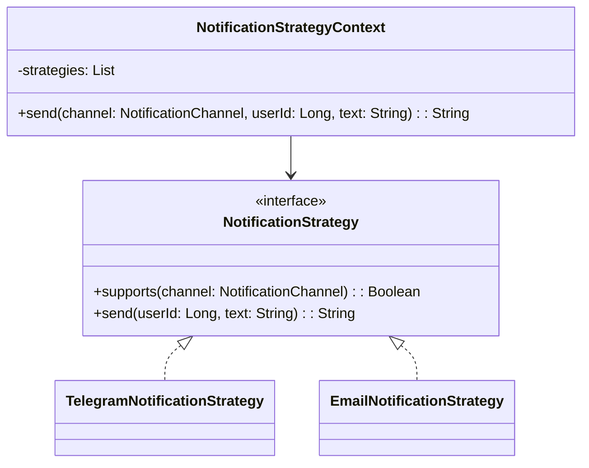

**Фрагмент кода:**
```kotlin
val context = NotificationStrategyContext(
    strategies = listOf(TelegramNotificationStrategy(), EmailNotificationStrategy())
)
val result = context.send(channel = NotificationChannel.TELEGRAM, userId = 11L, text = "Paid")
```

---

### Template Method

**Общее назначение:** зафиксировать общий алгоритм в базовом классе, оставив вариативные шаги в наследниках.

**Назначение в функционале:** общий пайплайн проведения платежа с разными реализациями конкретного провайдера (YooKassa/direct).

**UML:**
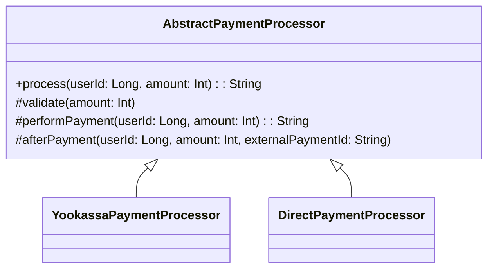

**Фрагмент кода:**
```kotlin
abstract class AbstractPaymentProcessor {
    fun process(userId: Long, amount: Int): String {
        validate(amount = amount)
        val externalPaymentId = performPayment(userId = userId, amount = amount)
        afterPayment(userId = userId, amount = amount, externalPaymentId = externalPaymentId)
        return externalPaymentId
    }
}
```

